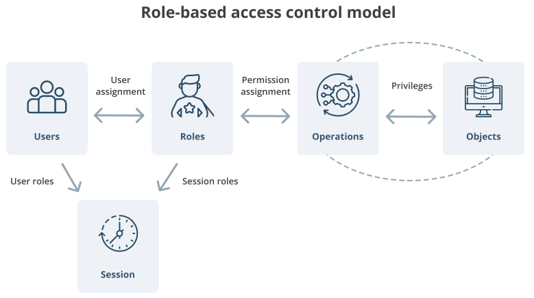

# EasyRBAC


[](LICENSE)


This project is a fork of [easyrbac](https://github.com/tasdikrahman/easyrbac), a role-based access control library for Python applications. Modifications and improvements have been made, expanding the scope of resources.

**NOTE**: _Still under heavy development._

## Features

- Role-Based Access Control (RBAC).
- Easy configuration via YAML files.
- Customization and extensibility.

## How to use

### Manual

```python
from rbac import RBAC, Role, User

admin_role = Role('admin')
default_role = Role('default')
User(name='nobody', roles=[default_role, admin_role])

rbac = RBAC()
rbac.resource_add_rule("admin", "api", "/api/resource")

if rbac.validate(username='nobody', method='api', resource='/api/resource'):
    print("access granted")
else:
    print("access denied")
```

### File

```python
# file: config.yaml
# rbac:
#   roles:
#   - name: admin
#     description: Role Admin
#     permissions:
#     - method: cli
#       resources:
#       - hello
#       - world
#   groups:
#   - name: admin
#     roles:
#     - admin
#     users:
#     - nobody

from rbac import RBAC

rbac = RBAC(rules='./config.yaml')

if rbac.validate(username='nobody', method='cli', resource='hello'):
    print("access granted")
else:
    print("access denied")
```

## Literature material

- [http://profsandhu.com/articles/advcom/adv_comp_rbac.pdf](http://profsandhu.com/articles/advcom/adv_comp_rbac.pdf)
- [http://www.comp.nus.edu.sg/~tankl/cs5322/readings/rbac1.pdf](http://www.comp.nus.edu.sg/~tankl/cs5322/readings/rbac1.pdf)
- [https://symas.com/ansi-rbac-intro/](https://symas.com/ansi-rbac-intro/)
- [https://iamfortress.net/2014/11/24/using-role-for-access-control-is-not-rbac/](https://iamfortress.net/2014/11/24/using-role-for-access-control-is-not-rbac/)
- [http://cloudify.co/2016/04/15/simple-secure-role-based-access-control-rest-api-rbac-server-devops-cloud-orchestration.html](http://cloudify.co/2016/04/15/simple-secure-role-based-access-control-rest-api-rbac-server-devops-cloud-orchestration.html)


## RBAC in simple terms

<p align="center">
  
</p>